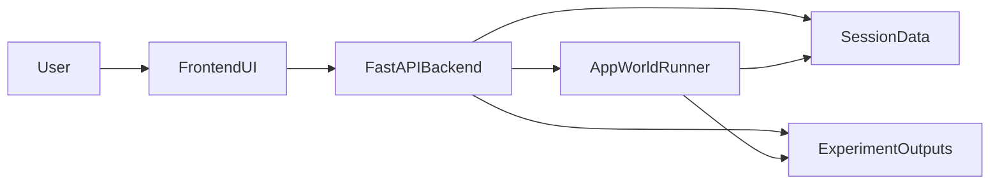

# A-EVOLVE Monorepo

[](https://github.com/A-EVO-Lab/a-evolve)

Note: A-evolve is under active development. Star ⭐ this repo to get notified about our latest update and benchmark results.

## 🚀 Roadmap & Community Evolution

We are evolving fast! Support our research by leaving a ⭐.

- [x] Release the official implementation of **[Position: Agentic Evolution is the Path to Evolving LLMs](https://arxiv.org/abs/2602.00359)** (arXiv 2602.00359).
- [ ] Open-source the distributed evolution infra (Massive-scale).
- [ ] Open-source the infra for more diverse benchmarks 

## What is A-EVOLVE?

A-EVOLVE is a framework for agentic evolution of LLMs at deployment time. Rather than relying on static training, A-EVOLVE treats deployment-time improvement as a deliberate, goal-directed optimization process — an autonomous evolver agent that diagnoses failures, proposes improvements, and persists durable changes over time.

This monorepo contains the core framework and a web UI for running and visualizing self-evolving AppWorld agents.

- `agentic-evolution/`: core A-EVOLVE framework and experiment runners
- `a-evolve-ui/`: React UI + FastAPI backend for session inspection and evolve controls


https://github.com/user-attachments/assets/6d3060b3-f163-4812-8de9-e6974d18bd04


## Citation

If you find this work useful, please cite our paper:

```bibtex
@article{lin2026agentic,
  title={Position: Agentic Evolution is the Path to Evolving LLMs},
  author={Lin, Minhua and Lu, Hanqing and Shi, Zhan and He, Bing and Mao, Rui and Zhang, Zhiwei and Wu, Zongyu and Tang, Xianfeng and Liu, Hui and Dai, Zhenwei and Zhang, Xiang and Wang, Suhang and Dumoulin, Benoit and Pei, Jian},
  journal={arXiv preprint arXiv:2602.00359},
  year={2026}
}
```

## Architecture



## Prerequisites

Choose one path:

- Local setup: Python 3.10+, Node.js 20+, npm
- Docker setup: Docker + Docker Compose

## Quick Start (Local One-Click)

```bash
bash setup.sh
bash start.sh
```

Then open:

- UI: `http://localhost:5173`
- API: `http://localhost:8000/api/health`

## Quick Start (Docker)

1. Create env file:

```bash
cp .env.example .env
```

2. Build and start services:

```bash
docker compose up --build
```

3. (First time) download AppWorld data into Docker volume:

```bash
bash docker/init-appworld.sh
```

Then open `http://localhost:5173`.

## Environment Variables

Required for evolve runs (at least one, depending on model):

- `ANTHROPIC_API_KEY`
- `OPENAI_API_KEY`
- `GOOGLE_API_KEY`

Optional overrides:

- `AEVOLVE_PYTHON_BIN`
- `AEVOLVE_SESSIONS_DIR`
- `AEVOLVE_EXPERIMENTS_DIR`
- `AEVOLVE_EXAMPLES_DIR`
- `APPWORLD_ROOT`

See `.env.example` for the template.

## Project Layout

```text
A_EVOLVE/
├── a-evolve-ui/
│   ├── src/                    # React frontend
│   ├── server/                 # FastAPI backend
│   └── scripts/dev.sh          # existing UI one-click dev script
├── agentic-evolution/
│   ├── agent/                  # agent implementations
│   ├── modules/                # observer/proposer/updater/tooling
│   ├── examples/               # experiment entry scripts
│   ├── tools_sandbox/sessions/ # evolve session artifacts (tools, skills, knowledge, patches)
│   └── experiments/outputs/    # evaluation outputs (vanilla vs evolved)
├── docker/
│   ├── Dockerfile.backend
│   ├── Dockerfile.frontend
│   └── init-appworld.sh
├── docker-compose.yml
├── setup.sh
└── start.sh
```

## Generated Artifacts

Each evolve run creates a **session** under `agentic-evolution/tools_sandbox/sessions/<session_id>/`.
Evaluation results are written to `agentic-evolution/experiments/outputs/<session_id>/`.

A sample session is included in the repo so you can explore the UI immediately after setup:

```text
agentic-evolution/tools_sandbox/sessions/appworld_claude-sonnet-4-20250514_train_50_20260219_011927/
├── observations/
│   └── batch_000.jsonl          # per-task observations (rewards, errors, traces)
├── proposals.jsonl              # proposer outputs (diagnosis, plan, apply, verify)
├── skills/                      # generated SKILL.md files
│   ├── spotify_authentication_workflow.md
│   ├── spotify_endpoint_validation.md
│   ├── spotify_pagination_batching.md
│   └── task_requirement_interpretation.md
├── tools/                       # generated Python tool modules (empty until tools are built)
├── registry.json                # tool registry (name -> metadata)
├── knowledge.json               # accumulated knowledge entries
├── patches.json                 # system prompt patches
├── results.json                 # per-task pass/fail results
├── summary_stats.json           # aggregate metrics across batches
├── version_snapshots/           # snapshots of evolution state over time
│   └── v_20260210_201125.json
└── evolve.log                   # full run log (streamed in UI)
```

The corresponding evaluation outputs live under:

```text
agentic-evolution/experiments/outputs/appworld_claude-sonnet-4-20250514_train_50_20260219_011927_vanilla/
agentic-evolution/experiments/outputs/appworld_claude-sonnet-4-20250514_train_50_20260219_011927_evolved/
└── tasks/<task_id>/             # per-task AppWorld evaluation databases and reports
```

You can override both paths via `AEVOLVE_SESSIONS_DIR` and `AEVOLVE_EXPERIMENTS_DIR`.

## Supported Models

- Anthropic Claude: `claude-haiku-4-5-20251001`, `claude-sonnet-4-20250514`, `claude-sonnet-4-5-20250929`
- OpenAI GPT: `gpt-5`, `gpt-5-mini`
- Google Gemini: `gemini-3-flash-preview`

## Subproject Docs

- UI details: `a-evolve-ui/README.md`
- Core framework details: `agentic-evolution/README.md`
 
## Supporting our research
If you find A-evolve helpful in your research or production, please give us a star! It helps our team secure more compute resources to push the boundaries of agentic evolution.

